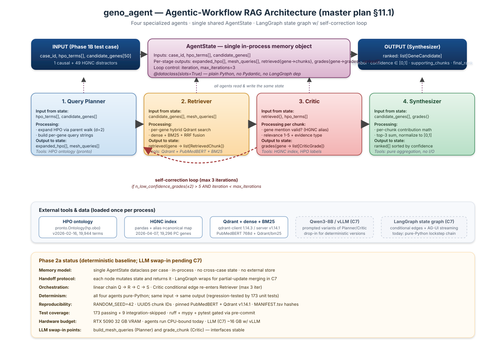

# geno_agent — Agentic Architecture Report

**Author:** Johanna Angulo (johanna.angulo@gmail.com)
**Project:** TFM, Universidad UAX — *Agentic Multi-Agent RAG for Gene Prioritization in Rare Mendelian Disease*
**Repository:** [github.com/Jangulo7/geno_agent](https://github.com/Jangulo7/geno_agent) (private)
**Reference:** [`MASTER_PROJECT_v2.1.md`](../MASTER_PROJECT_v2.1.md) §11
**Status snapshot:** Phase 2a deterministic baseline complete (PRs #22–#26 merged); C7 (LangGraph + Qwen3-8B) pending.

This document is the canonical architectural reference for the agentic
layer of `geno_agent`. It explains how the four specialized agents
(Query Planner, Retriever, Critic, Synthesizer) are organized, how state
flows between them, how memory is managed, what tools each agent uses,
and why this multi-agent decomposition is the appropriate response to
the rare-disease causal-gene-prioritization research problem.

---

## Table of contents

1. The research problem and why an agentic architecture
2. High-level architecture
3. Memory model
4. Handoff protocol between agents
5. Per-agent specification (inputs · processing · outputs · tools)
6. System orchestration
7. Tech stack and justification
8. Why this architecture answers the research challenge
9. Reproducibility and evaluation hooks
10. Roadmap from deterministic baseline to LLM-driven variant
11. References to repository code

---

## 1. The research problem and why an agentic architecture

### 1.1 The clinical problem

Rare diseases collectively affect ~300 million people worldwide; ~50 % of
exome-sequencing referrals remain undiagnosed even with current
phenotype-driven tools. The diagnostic gap is most pronounced for novel
or under-annotated causal genes whose phenotype-gene associations exist
**only in unstructured PubMed Central (PMC) literature** — PMC indexes
over a million new articles per year, far beyond what hand-curation can
keep current.

The clinical-genetics question this project addresses:

> Given a patient's HPO phenotype profile and a list of 50 candidate
> genes from upstream variant calling, which gene is most plausibly
> causal, with citations?

### 1.2 Why a single-pass RAG system is insufficient

A monolithic RAG ([Lewis et al., 2020](https://arxiv.org/abs/2005.11401))
issues one retrieval and one generation per query. For the gene-prioritization
problem this fails on three counts:

1. **No per-chunk relevance grading.** The generator sees the top-K
   chunks but cannot reject individual chunks as off-topic; spurious
   retrievals contaminate the answer.
2. **No iterative query refinement.** If the first retrieval misses
   the relevant evidence (a real risk in long-tail rare-disease
   literature), single-pass RAG cannot recover.
3. **No structured intermediate outputs.** A clinician needs to inspect
   the reasoning chain — which chunks were considered, how each was
   graded, why a particular gene rose to the top — not just the final
   answer.

### 1.3 The agentic decomposition

A multi-agent design with explicit specialist roles addresses each gap:

| Agent | Specialist role | Gap addressed |
|---|---|---|
| **Query Planner** | HPO graph reasoning + query construction | Hand-crafts queries that exploit ontology structure |
| **Retriever** | High-recall hybrid search | Dense + BM25 + RRF over PMC OA index |
| **Critic** | Per-chunk relevance grading | Each chunk gets a 1-5 grade with rationale |
| **Synthesizer** | Aggregation with explainable scoring | Per-gene confidence in [0,1] with cited supporting chunks |

A **conditional self-correction edge** from the Critic back to the
Retriever — if too many low-confidence grades remain after a pass and
the iteration budget is not exhausted — gives the system a chance to
recover from a poor first retrieval. Single-pass RAG cannot do this.

The thesis evaluation (master plan §11.5) tests this decomposition
against three controls in a 2×2+1 factorial:

|     | Dense-only retrieval | Hybrid retrieval |
|-----|----------------------|------------------|
| **Single-agent** | Cell A — control | Cell B — retrieval contribution |
| **Multi-agent**  | Cell C — agentic contribution | Cell D — full system |

Plus **Cell E: Exomiser** (phenotype-driven, no literature) as the
established gold-standard baseline.

---

## 2. High-level architecture



The system is a **stateful directed graph** of four agents reading and
writing a single shared memory object, the `AgentState`. The default
sequential flow is:

```
INPUT → Query Planner → Retriever → Critic → Synthesizer → OUTPUT
                              ↑           |
                              └── (loop) ─┘ (max 3 iterations)
```

Each agent is implemented as a Python function ("node") that takes the
state, performs its specialized work, mutates the state in place, and
returns it. The orchestration layer (LangGraph in C7; today a pure
function chain) is responsible for routing between nodes — including
the conditional self-correction edge from the Critic.

---

## 3. Memory model

### 3.1 Single shared `AgentState`

The entire conversation between agents is mediated by **one Python
dataclass instance per case**:

```python
# src/agents/state.py
@dataclass(slots=True)
class AgentState:
    case_id: str                                    # input
    hpo_terms: list[str]                            # input
    candidate_genes: list[str]                      # input

    expanded_hpo: list[str]                         # written by Planner
    mesh_queries: list[str]                         # written by Planner
    retrieved: dict[str, list[RetrievedChunk]]      # written by Retriever
    grades: dict[str, list[CriticGrade]]            # written by Critic
    ranked: list[GeneCandidate]                     # written by Synthesizer

    iteration: int                                  # loop control
    max_iterations: int = 3                         # loop control
```

There is **no external memory store, no conversation buffer, no vector
memory across cases.** Each Phase 1B test case gets its own
`AgentState`; nothing persists between cases. This is a deliberate
choice for two reasons:

1. **Reproducibility.** A run on a given case is fully determined by
   its inputs + the deterministic seeds + the pinned models — no
   "previous conversation history" lurking in a database.
2. **Per-case parallelism.** The 75-case Phase 1B benchmark can be run
   concurrently across processes without locking a shared memory store.

### 3.2 What is cached (process-scoped)

Heavy resources are loaded once per Python process via `@lru_cache`:

| Resource | Loader | Cache key |
|---|---|---|
| HPO ontology (`pronto.Ontology`) | `src.tools.hpo.load_hpo` | obo path |
| HGNC index (`HgncIndex` namedtuple) | `src.tools.hgnc.load_hgnc` | tsv path |
| PubMedBERT model | `SentenceTransformer(...)` (per-instance) | constructor args |
| BM25 model | `SparseTextEmbedding("Qdrant/bm25")` | constructor args |

Process-scope means tests can `load_*.cache_clear()` to reset between
runs; production processes pay the loading cost once.

### 3.3 What is not cached

- **Retrieved chunks** are re-fetched per case — the Retriever does not
  remember previous cases' retrievals. This avoids stale results when the
  underlying Qdrant index changes.
- **Critic grades** are recomputed per case — they depend on the
  patient's specific HPO labels, which differ case by case.

### 3.4 Conversation history

There is no conversation history. The agents communicate exclusively
through the state object; there is no chat log, no memory of prior
agent outputs except what each agent has written into the state for
downstream agents to read.

This is intentional. For evaluation purposes, every result is
attributable to a deterministic combination of inputs + state mutations
— there is no hidden context to debug.

---

## 4. Handoff protocol between agents

### 4.1 Today: pure-Python state mutation

Each agent node has the signature:

```python
def some_node(state: AgentState, *deps, **opts) -> AgentState:
    # Read fields from state.
    # Compute work using deps (HPO ontology, HGNC index, Qdrant client).
    # Mutate state in place.
    return state
```

Handoff is **direct function composition**:

```python
# Today (deterministic baseline) — pure function chain
state = AgentState(case_id, hpo_terms, candidate_genes)
state = query_planner_node(state, hpo_ontology)
state = retriever_node(state, search_cfg)
state = critic_node(state, hpo_ontology, hgnc_index)
state = synthesizer_node(state)
# state.ranked now contains the final 50-gene ranking
```

No serialization, no message bus. Each function reads the fields its
upstream wrote and writes the fields its downstream consumes.

### 4.2 Tomorrow: LangGraph state graph (C7)

In C7 we wrap the same node functions into a [LangGraph](https://github.com/langchain-ai/langgraph)
`StateGraph`. LangGraph adds three things on top of the bare function chain:

1. **Conditional routing** between nodes (the Critic→Retriever loop).
2. **Partial-update merging**: nodes can return only the fields they
   changed and LangGraph reduces them into the state dict.
3. **AG-UI streaming** to the CopilotKit React frontend (master plan
   §11.2): each state mutation is streamed as an SSE event so the UI
   shows agent reasoning live.

The function-level interface (one `def node(state, ...) -> state`)
stays identical — LangGraph is an orchestration wrapper, not a refactor
of the agents.

### 4.3 Why state mutation rather than message passing?

For the kind of structured data this system passes between agents
(retrieved chunks, per-chunk grades, gene rankings), serializing into
"messages" and deserializing back into typed objects is unnecessary
overhead. Direct dataclass mutation is:

- **Type-safe** (mypy validates the shape end-to-end).
- **Zero-copy** (no JSON encode/decode).
- **Inspectable** (debugger sees the full state at any node boundary).

Trade-off: agents are tightly coupled to the `AgentState` schema.
Schema changes ripple through every agent that reads the affected
field. We mitigate by keeping `AgentState` minimal and centralized in
one file (`src/agents/state.py`) with a curated `CANONICAL_FIELDS` list
in the Phase 1B finalize step, so any change is visible at one chokepoint.

---

## 5. Per-agent specification

### 5.1 Query Planner — `src/agents/query_planner.py`

**Role.** Transform the patient's input phenotype into ontology-broadened,
gene-targeted query strings for the Retriever.

| | |
|---|---|
| **Inputs (state read)** | `hpo_terms`, `candidate_genes` |
| **Tools** | HPO ontology (`pronto.Ontology`) |
| **Outputs (state write)** | `expanded_hpo` (HPO IDs after parent walk), `mesh_queries` (one per candidate gene) |

**Processing pipeline:**

1. **HPO expansion.** For each HPO term in the patient's input, walk
   `distance=2` parent edges. Dedup. Order: input term first, then
   ancestors (BFS).
2. **Label resolution.** For each expanded HPO ID, look up the display
   name (e.g., `HP:0001250` → `"Seizure"`). Cap at top-5 labels.
3. **Per-gene query construction.** For each candidate gene, build:
   `f"{gene_symbol} {label1} {label2} ..."`. Gene first (BM25 anchor);
   labels after (dense semantic context).

**Why this design:**

- HPO expansion broadens recall. A patient's specific HPO term may not
  match published literature exactly; ancestors do.
- Gene-first ordering exploits the asymmetry between BM25 (anchored on
  gene symbol) and dense embedding (broader phenotype context).
- Per-gene queries (50 total per case) keep the Retriever fast — one
  Qdrant call per gene rather than 50 × N_HPO calls.

**LLM swap-in (C7).** `build_mesh_queries` becomes the LLM-prompted
variant. The same input/output contract; just smarter query generation.

### 5.2 Retriever — `src/agents/retriever.py`

**Role.** Pull top-K most relevant chunks per gene from the populated
Qdrant index.

| | |
|---|---|
| **Inputs (state read)** | `candidate_genes`, `mesh_queries` |
| **Tools** | `SearchConfig` (Qdrant client + dense + BM25 models) |
| **Outputs (state write)** | `retrieved` dict keyed by gene → list[RetrievedChunk] |

**Processing pipeline:**

For each `(gene, query)` pair:

1. **Hybrid search** with default `mode="hybrid"`:
   - Dense vector via `SentenceTransformer.encode(query, normalize_embeddings=True)`
   - BM25 sparse vector via `SparseTextEmbedding.query_embed([query])` (TF-only;
     IDF is server-side via `Modifier.IDF`)
   - Reciprocal-rank fusion via Qdrant `FusionQuery(Fusion.RRF)`
2. Return top-K (default 10) `RetrievedChunk` objects with their RRF
   scores.
3. Optional `gene_filter` (off by default): forwards the gene symbol as
   a Qdrant `MatchText` payload filter so all hits must mention the gene
   in their text.

**Why this design:**

- **Hybrid is the empirically right default for biomedical retrieval.**
  Dense embeddings capture semantic phenotype-gene associations; BM25
  catches exact gene symbols (which are short tokens that dense models
  can mis-handle). RRF fuses at query time.
- **Modes are exposed** (`dense` / `bm25` / `hybrid`) for the §11.5
  evaluation factorial — cells A and C use `dense`, B and D use `hybrid`.
- **Per-gene filtering off by default** keeps recall high; the Critic
  applies the gene-mention check downstream.

### 5.3 Critic — `src/agents/critic.py`

**Role.** Grade each retrieved chunk for evidential quality.

| | |
|---|---|
| **Inputs (state read)** | `retrieved`, `expanded_hpo` (or `hpo_terms`) |
| **Tools** | HGNC index, HPO ontology (for label lookup) |
| **Outputs (state write)** | `grades` dict keyed by gene → list[CriticGrade] |

**Per-chunk grading produces a `CriticGrade`:**

```python
@dataclass(slots=True)
class CriticGrade:
    chunk_id: str
    gene_mention_valid: bool         # canonical or alias regex match
    relevance: int                   # 1-5 ordinal
    evidence_type: EvidenceType      # case_report | functional | association | review | unknown
    rationale: str                   # human-readable one-liner for the UI
```

**Three sub-checks:**

| Sub-check | Rule |
|---|---|
| `grade_gene_mention` | Word-boundary regex over chunk text matching the canonical HGNC symbol OR any HGNC-recognized alias. Case-insensitive. |
| `grade_relevance` | 5-step ordinal: gene + 2 HPO labels in 200-char co-occurrence → 5; gene + 1 label → 4; gene only → 3; labels only → 2; neither → 1. |
| `classify_evidence_type` | First-match priority: section_type=`case` → case_report; functional cue regex → functional; association cue regex → association; section=`introduction` + review cue → review; case cue → case_report; else → unknown. |

**Rationale string** combines all three into a UI-friendly summary:
*"BRCA1 mentioned; 2 HPO labels matched (Seizure, Global delay); relevance=5; evidence=case_report"*.

**Why this design:**

- **Per-chunk explicit grading** is the Critic's whole reason for
  existing — it's what single-pass RAG cannot do. The 1-5 ordinal
  matches clinical-genetics convention (ACMG variant classification
  uses similar ordinal evidence levels).
- **Gene mention with alias resolution** (e.g., `HER2`→`ERBB2`) prevents
  false negatives when papers use historical names.
- **Evidence-type classification** is informational metadata for the UI
  (clinicians weight a case report differently from a meta-analysis)
  and feeds the Synthesizer's evidence-weight aggregation.

**LLM swap-in (C7).** `grade_chunk` is the obvious target — Qwen3-8B
prompted with chunk + HPO + gene returns a structured grade.

### 5.4 Synthesizer — `src/agents/synthesizer.py`

**Role.** Aggregate per-chunk grades into per-gene confidence scores
and produce the final ranked output.

| | |
|---|---|
| **Inputs (state read)** | `candidate_genes`, `grades` |
| **Tools** | None (pure aggregation) |
| **Outputs (state write)** | `ranked` (list of `GeneCandidate` sorted by descending confidence) |

**Aggregation math:**

```
chunk_contribution = relevance × evidence_weight × mention_multiplier

  evidence_weight: case_report=1.0 · functional=1.0 · association=0.8
                 · review=0.6 · unknown=0.5
  mention_multiplier: 1.0 if gene_mention_valid else 0.3

per_gene_score = sum(top-3 contributions) / (3 × 5.0), clamped to [0, 1]
```

A confidence of `1.0` means "the top 3 supporting chunks each had
maximum-relevance, gene-mentioned, case-report or functional evidence".
`0.0` means the gene was not found in retrieval at all.

**Output GeneCandidate:**

```python
@dataclass(slots=True)
class GeneCandidate:
    symbol: str
    is_causal: bool                  # ground-truth flag (Phase 1B eval only)
    aggregate_confidence: float      # in [0, 1]
    supporting_chunks: list[str]     # top-3 chunk IDs
    final_rank: int                  # 1 = highest confidence
```

Stable sort tie-breaks on the input `candidate_genes` order. Genes with
no grades score 0.0 and land last.

**Why this design:**

- **Linear weighted-sum aggregation** is explainable: a clinician can
  trace any gene's score back to specific contributing chunks and their
  individual contributions.
- **Top-K (default 3) summation rather than mean** avoids dilution
  from many low-relevance chunks. A single strong piece of evidence
  shouldn't be drowned out by 20 weak ones.
- **Normalization to [0, 1]** makes scores comparable across cases for
  evaluation (e.g., MRR computation over the Phase 1B benchmark).
- **Pure aggregation (no I/O)** keeps the Synthesizer fast and
  deterministic — easy to unit-test, easy to evaluate.

---

## 6. System orchestration

### 6.1 Default sequential flow

```
INPUT (case_id, hpo_terms, candidate_genes[50])
  │
  ▼
[Query Planner]   reads: hpo_terms, candidate_genes
                  writes: expanded_hpo, mesh_queries
  │
  ▼
[Retriever]       reads: candidate_genes, mesh_queries
                  writes: retrieved{gene → list[RetrievedChunk]}
  │
  ▼
[Critic]          reads: retrieved, expanded_hpo, hgnc_index
                  writes: grades{gene → list[CriticGrade]}
                  (optional self-correction loop back to Retriever)
  │
  ▼
[Synthesizer]    reads: candidate_genes, grades
                  writes: ranked = list[GeneCandidate]
  │
  ▼
OUTPUT (state.ranked — sorted candidates with citations)
```

Each agent runs once per case in the default flow. The conditional
self-correction edge from the Critic can extend a single case's
processing to up to `max_iterations` (default 3) Retriever→Critic loops.

### 6.2 Self-correction loop

```python
# src/agents/state.py
def n_low_confidence_grades(self, threshold: int = 2) -> int:
    return sum(
        1 for grades in self.grades.values()
        for g in grades if g.relevance <= threshold
    )

def remaining_iterations(self) -> int:
    return max(0, self.max_iterations - self.iteration)
```

The C7 LangGraph builder will use these to define the conditional edge:

```python
# Pseudocode for the conditional edge function
def critic_routing(state: AgentState) -> Literal["retriever", "synthesizer"]:
    if state.remaining_iterations() > 0 and state.n_low_confidence_grades() > 5:
        return "retriever"
    return "synthesizer"
```

Each loop iteration potentially adds new chunks to `state.retrieved`
(by trying a different query strategy or expanding the HPO walk
distance). The Critic re-grades; the loop continues until either
the budget is exhausted or the low-confidence count drops below threshold.

### 6.3 Why this orchestration?

**Linear default + self-correction loop** is the simplest topology that
preserves the multi-agent value:

- **Linear** because the natural information flow is forward (you can't
  grade chunks you haven't retrieved; you can't rank without grades).
- **Self-correction** because real biomedical queries don't always
  retrieve the right evidence on the first pass.

Alternative topologies considered:

- **Parallel agents** (e.g., multiple Critics voting): adds complexity
  without clear benefit at this scale.
- **Hierarchical orchestrator agent** (CrewAI-style): adds a meta-agent
  layer that needs its own state and reasoning; not justified for a
  4-agent system.
- **Pure feedback loops** (every agent can call any other): unbounded
  state space, hard to evaluate, breaks reproducibility.

---

## 7. Tech stack and justification

### 7.1 Active stack (Phase 2a baseline)

| Layer | Choice | Version | Justification |
|---|---|---|---|
| Language | Python | 3.12.3 | Modern type system, slots dataclasses, broad ML lib support |
| State schema | `@dataclass(slots=True)` | stdlib | Zero deps, mypy-strict, fast attribute access |
| Ontology parsing | `pronto` | 2.7.3 | Pure-Python OBO parser, no DB needed, works on the pinned 2026 HPO/MONDO/GO releases |
| Tabular | `pandas` | 2.2.3 | HGNC TSV loading, alias map construction |
| Vector DB | `qdrant-client` + `qdrant/qdrant:v1.14.1` | 1.14.3 / v1.14.1 | First-class hybrid retrieval, `Modifier.IDF`, on-disk payload, RRF native |
| Dense embeddings | `sentence-transformers` + `NeuML/pubmedbert-base-embeddings` | 4.1.0 | PubMedBERT is the canonical biomedical sentence encoder; 768-dim fits the master-plan schema |
| Sparse embeddings | `fastembed` (`Qdrant/bm25`) | 0.8.0 | Native Qdrant BM25; document-side TF+IDF, query-side TF only (asymmetric per master plan §4 step 5) |
| Tooling | `ruff` + `mypy` + `pytest` + `pre-commit` | 0.15.12 / 2.0.0 / 8.3.5 / 4.6.0 | Single-tool lint+format (ruff), strict types on `src/`, gated via pre-commit hooks |

### 7.2 Planned stack (Phase 2b/2c — C7+)

| Layer | Choice | Justification |
|---|---|---|
| Agent orchestration | `langgraph` | State graph with conditional edges; native AG-UI streaming; LangChain-compatible |
| Reasoning LLM | **Qwen3-8B Instruct** via **vLLM** | 8B params fit RTX 5090 32 GB VRAM with KV-cache headroom; vLLM ≥5 tok/s under multi-agent load; strong biomedical reasoning vs comparable open-weights |
| API | `FastAPI` + `uvicorn` + `sse-starlette` + `copilotkit` (Python SDK) | Speaks AG-UI protocol natively; SSE for live agent traces |
| UI framework | **CopilotKit** React (forked at [`Jangulo7/agent_UI`](https://github.com/Jangulo7/agent_UI)) | First-class LangGraph integration; ships chat UI + generative UI + human-in-the-loop primitives |
| Frontend stack | Next.js 14 + React 18 + Node.js 20+ | CopilotKit's recommended setup |

### 7.3 Why these choices over alternatives?

**Why dataclass-based state over Pydantic or TypedDict?**
- Pydantic adds runtime validation overhead and a heavy dependency.
- TypedDict can't carry helper methods like `remaining_iterations()`.
- Slots dataclass gives the same attribute-access ergonomics as Pydantic
  with zero dependency, plus mypy-strict checking.

**Why LangGraph over CrewAI / LangChain Agents / AutoGen?**
- LangGraph is **state-graph-first**: explicit nodes, explicit edges,
  explicit conditional routing. The other frameworks lean toward
  prompted "free-form" agents that decide routing autonomously, which is
  harder to evaluate quantitatively.
- LangGraph is the **AG-UI protocol's primary integration target** —
  CopilotKit's `copilotkit-sdk-python` exposes a LangGraph state graph
  as an HTTP+SSE endpoint with one decorator.

**Why local Qwen3-8B over GPT-4 / Claude / cloud LLMs?**
- **Reproducibility:** a pinned local model is byte-stable across
  hardware; cloud models silently update.
- **Privacy:** any future extension to protected clinical data cannot
  send patient HPO terms to a third-party API.
- **Cost:** zero per-call cost over many evaluation runs.
- **Hardware fit:** 8B params + KV cache + PubMedBERT + Qdrant queries
  fit comfortably in 32 GB VRAM on the host's RTX 5090.

**Why CopilotKit over a custom React frontend?**
- CopilotKit ships chat UI, streaming, generative UI, and HITL
  primitives out of the box.
- The user already has the upstream forked at `Jangulo7/agent_UI`.
- MIT-licensed, fully self-hostable.

**Why deterministic baseline before LLM?**
- The four agents' interfaces (input/output dataclasses) are exercised
  end-to-end **today** by 173 unit tests — without any LLM, GPU, or
  Qdrant connection.
- LLM responses are non-deterministic; a deterministic baseline lets us
  separate "is the orchestration correct?" (always answerable) from "is
  the LLM smart enough?" (only answerable empirically).
- The deterministic baseline is also a valid evaluation cell on its own
  — it's the "no-LLM rule-based" benchmark to compare LLM variants
  against in the §11.5 factorial.

---

## 8. Why this architecture answers the research challenge

### 8.1 The hypothesis

> **An agentic, multi-agent RAG architecture, deployed on local
> hardware and grounded in the published literature, can meaningfully
> assist literature evidence synthesis for rare-disease causal-gene
> prioritization.**

### 8.2 What "meaningfully assist" requires architecturally

| Requirement | How this architecture delivers |
|---|---|
| **Quantitative comparison vs Exomiser** | Synthesizer outputs `aggregate_confidence ∈ [0,1]` per gene → MRR / NDCG@K computable on the Phase 1B 75-case benchmark |
| **Per-chunk evidence audit** | Critic emits `CriticGrade` per chunk with `rationale` string → UI can show *why* each gene scored what it scored |
| **Citations** | `GeneCandidate.supporting_chunks` carries the chunk_ids → trivial to follow back to PMC IDs and section types |
| **Self-correction** | Critic→Retriever conditional edge → recovery from poor first retrieval |
| **Local deployment** | Single workstation: RTX 5090, 64 GB RAM, no cloud dependency → reproducible by independent researchers; extensible to clinical data |
| **Reproducibility** | Pinned versions + UUID5 chunk IDs + `RANDOM_SEED=42` + full SHA-256 in `MANIFEST.tsv` → byte-identical outputs across runs |
| **Quantitative evaluation** | Deterministic baseline + LLM variant: 4 of the 5 evaluation cells are pure code, the LLM is one isolated swap-in |

### 8.3 What multi-agent enables that single-agent cannot

1. **Per-chunk grading is empirically necessary.** The §11.5 factorial
   directly tests this: cells C and D (multi-agent) vs cells A and B
   (single-agent). The hypothesis is that the multi-agent's explicit
   per-chunk gating produces a meaningfully higher top-K accuracy on
   long-tail rare-disease cases.
2. **Self-correction is empirically necessary.** Same factorial: the
   multi-agent cells include the conditional Retriever loop. If the
   first retrieval misses the causal evidence, the loop is the only
   mechanism for recovery without an external orchestrator.
3. **The agent-decomposition is the explanation interface.** A clinician
   can see: "the Query Planner expanded HPO X to its parent Y, the
   Retriever returned 10 chunks for gene Z, the Critic graded 3 of
   those at relevance 5, the Synthesizer ranked Z first because of
   those 3 chunks." That narrative cannot be reconstructed from a
   single-pass system's output.

### 8.4 What this architecture is NOT claiming

- **Not novel in technique.** RAG, multi-agent LLM systems, hybrid
  retrieval, and PMC corpora are all established. The contribution is
  *application of these techniques, in this combination, to this
  clinical problem, with rigorous reproducibility design and a 2×2+1
  factorial against an external baseline*.
- **Not a CE-marked clinical device.** This is a research prototype.
- **Not a replacement for a clinician.** It's a literature-evidence
  synthesizer that augments the hours of search a genetics team
  currently does manually.

---

## 9. Reproducibility and evaluation hooks

### 9.1 Reproducibility surfaces

| Surface | Mechanism |
|---|---|
| Random seeds | `apply_seeds(42)` at every entrypoint; `PYTHONHASHSEED=42` in `.env` |
| Chunk IDs | `uuid5(NAMESPACE, "pmcid|section_type|chunk_index|blake2b(text)")` |
| Per-case derived seeds | `blake2b(global_seed | case_id)` for distractor sampling |
| Stratified sample | `random.Random(42)` over alphabetically-sorted case IDs |
| Ontology versions | HPO `v2026-02-16`, MONDO `v2026-03-03`, GO `2026-03-25`, HGNC `2026-04-07` (SHA-256 in `MANIFEST.tsv`) |
| Embedding model | `NeuML/pubmedbert-base-embeddings` (mean-pooled, L2-normalized) |
| BM25 model | `Qdrant/bm25` via `fastembed` (no hash-of-whitespace fallback) |
| Qdrant server | `qdrant/qdrant:v1.14.1` (pinned image) |
| Python deps | All 21 deps in `pyproject.toml` pinned to exact `==X.Y.Z` |
| Test invariants | 173 unit tests covering each agent's contract; `stable_hash("geno_agent")==11547620462806487235` regression-tested |

### 9.2 Evaluation hooks (master plan §11.5)

The architecture is built to support the 2×2+1 evaluation factorial:

| Cell | Configuration | Where the switch lives |
|---|---|---|
| **A** Single-agent dense | bypass Planner/Critic, use a single Synthesizer over dense-only retrieval | `mode="dense"` in Retriever; skip Critic |
| **B** Single-agent hybrid | bypass Planner/Critic, hybrid retrieval | `mode="hybrid"` in Retriever; skip Critic |
| **C** Multi-agent dense | full agent chain, dense-only retrieval | `mode="dense"` in Retriever |
| **D** Multi-agent hybrid (full system) | full chain, hybrid retrieval | `mode="hybrid"` (default) |
| **E** Exomiser baseline | external — runs Exomiser CLI on the same Phase 1B cases | not in this codebase |

For each cell, all 75 Phase 1B cases are run; per-case ranking →
top-1/top-5/top-10/MRR/NDCG@10 metrics → paired bootstrap CIs over
cases. Statistical significance via 1000 resamples, 95 % CI. Output:
LaTeX-ready table per metric.

### 9.3 Test infrastructure as a reproducibility surface

The 173 unit tests + integration tests act as **executable specifications**
for the architecture:

- Schema regression: `RetrievedChunk`, `CriticGrade`, `GeneCandidate`
  field shapes are pinned by tests.
- Agent contract: each node's input/output behavior is verified on
  hand-built cases.
- Reproducibility invariants: `stable_hash("geno_agent")` known value;
  UUID5 namespace pin; deterministic ordering checks.
- Tooling: ruff + mypy + pytest gated via pre-commit hook on every commit.

If any of these regress, the pre-commit gate refuses the commit.

---

## 10. Roadmap from deterministic baseline to LLM-driven variant

### 10.1 Where the LLM hooks in

The deterministic baseline has **two LLM swap-in points**, both with
stable function-level interfaces:

| Function | Today (deterministic) | Tomorrow (Qwen3-8B prompted) |
|---|---|---|
| `src.agents.query_planner.build_mesh_queries` | gene-symbol + top-5 HPO labels | LLM reasons about which HPO terms are most diagnostic, generates richer queries |
| `src.agents.critic.grade_chunk` | regex-based relevance + section heuristics | LLM reads (chunk + HPO + gene), returns structured `CriticGrade` |

The Synthesizer remains pure aggregation — there is no compelling reason
to put an LLM in the aggregation step (it would just add noise to a
clean math operation).

### 10.2 C7 implementation plan

1. **Install** `langgraph` + `vllm` into pytorch-env.
2. **Download** Qwen3-8B weights to `~/rare-disease-rag/models/Qwen3-8B/`.
3. **Stand up vLLM** in a Docker container alongside Qdrant.
4. **Wire** the four nodes into a `langgraph.StateGraph` with the
   Critic→Retriever conditional edge.
5. **Add** prompted variants of `build_mesh_queries` and `grade_chunk`.
6. **Smoke test** the full graph against a Phase 1B case end-to-end.

The deterministic chain stays as the always-available baseline (cells
A/B in the factorial). The LLM variants are evaluated against the
deterministic baseline to isolate the LLM's contribution.

### 10.3 Beyond C7 — Phase 2b and 2c

| Sub-phase | Deliverable | Estimated effort |
|---|---|---|
| **C7** | LangGraph wiring + Qwen3-8B prompted variants | ~1 week |
| **2b** | FastAPI + `copilotkit-sdk-python` HTTP/SSE endpoint | ~2 days |
| **2c** | CopilotKit React UI (`HPOPicker`, `CandidateGeneList`, `AgentTracePanel`, `GeneCandidateCard`, `CitationHover`) | ~3-5 days |
| **Eval** | 2×2+1 factorial harness + LaTeX results | ~3 days |

After all of the above, the thesis can claim quantitative results vs
Exomiser on the Phase 1B benchmark — the headline contribution.

---

## 11. References to repository code

| Topic | File |
|---|---|
| State schema | [`src/agents/state.py`](../src/agents/state.py) |
| Query Planner | [`src/agents/query_planner.py`](../src/agents/query_planner.py) |
| Retriever | [`src/agents/retriever.py`](../src/agents/retriever.py) |
| Critic | [`src/agents/critic.py`](../src/agents/critic.py) |
| Synthesizer | [`src/agents/synthesizer.py`](../src/agents/synthesizer.py) |
| HPO tool | [`src/tools/hpo.py`](../src/tools/hpo.py) |
| HGNC tool | [`src/tools/hgnc.py`](../src/tools/hgnc.py) |
| Qdrant search tool | [`src/tools/qdrant_search.py`](../src/tools/qdrant_search.py) |
| Tests (40 + 15 + 12 + 24 + 21 = 112 in src/agents) | [`tests/test_state.py`](../tests/test_state.py), [`test_query_planner.py`](../tests/test_query_planner.py), [`test_retriever.py`](../tests/test_retriever.py), [`test_critic.py`](../tests/test_critic.py), [`test_synthesizer.py`](../tests/test_synthesizer.py) |
| Master plan §11 (Phase 2 spec) | [`MASTER_PROJECT_v2.1.md`](../MASTER_PROJECT_v2.1.md) §11 |
| Project rules | [`CLAUDE.md`](../CLAUDE.md) |
| Tooling config | [`pyproject.toml`](../pyproject.toml), [`.pre-commit-config.yaml`](../.pre-commit-config.yaml) |

### Relevant prior PRs

| PR | Description |
|---|---|
| #22 | C1+C2 — state schema + HPO/HGNC/Qdrant tools |
| #23 | C3 — Query Planner |
| #24 | C4 — Retriever |
| #25 | C5 — Critic |
| #26 | C6 — Synthesizer |

---

*End of architecture report. This document is the authoritative
reference for the agentic layer; regenerate after C7 to add the
LangGraph wiring and LLM swap-in details.*
